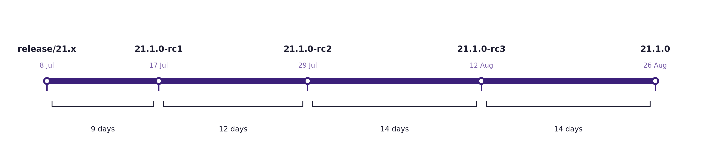
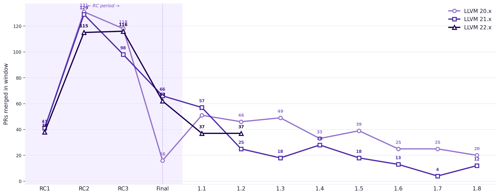
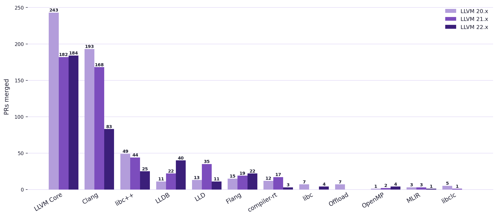
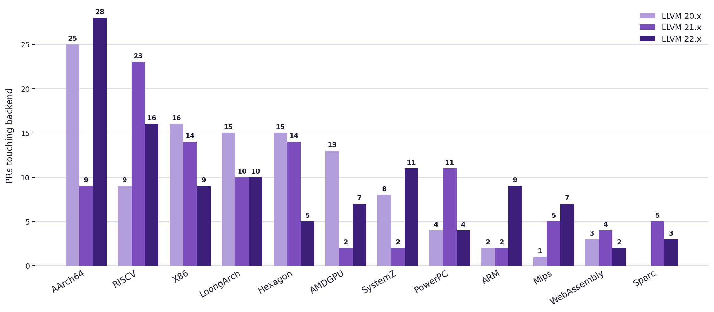
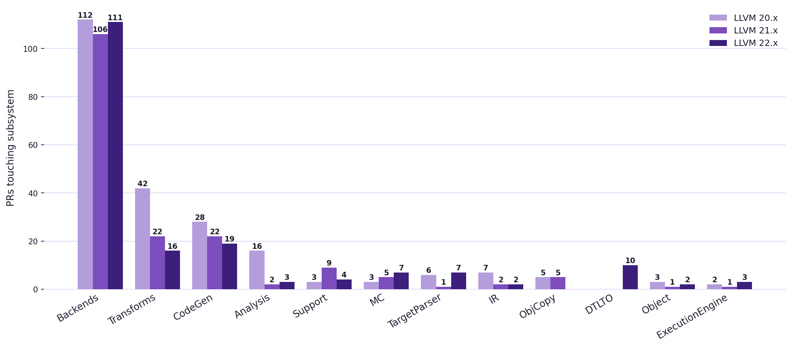
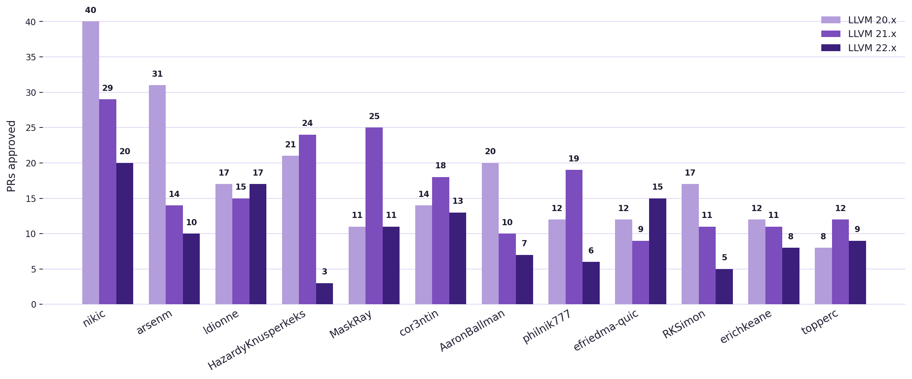
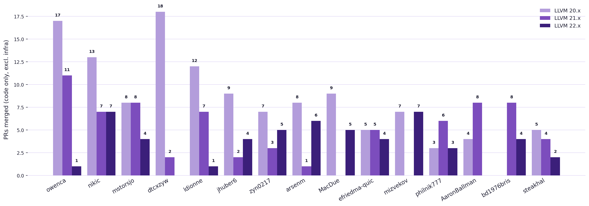

## LLVM Release Process
### EuroLLVM 2026 Status Update
Cullen Rhodes, Douglas Yung, Tobias Hieta

---

# Introductions

Note:
Welcome to your boring "eat your vegetables" session of the conference. Here you won't learn about a cool new optimization, some crazy size reduction or a three layered MLIR cake. We will just talk about the release process for 20 minutes. But first some introductions:

Cullen: [Cullen intro]

Douglas: [Douglas intro]

Tobias: And I am Tobias Hieta, I have been involved in the release process since LLVM 10 and been a release manager together with Tom since LLVM 15. I mostly work with AAA games and LLVM, currently working on Divinity for Larian.

---

# Agenda
* Current Process
* Recent Changes
* What Works?
* What Doesn't Work?
* Your Turn

Note:
Quick overview of what we'll cover. We want this to be interactive — especially toward the end. We have a roundtable slot and want to hear from you.

---

# Current Process

* Major release every **6 months**
* Branch: 2nd Tuesday in **January** (even) / **July** (odd)
* Point releases every 2 weeks, typically through X.1.5 or X.1.6

Note:
Even-numbered releases branch in January, odd-numbered in July. The RC schedule is tight: rc1 goes out just 3 days after the branch, rc2 at 2 weeks, rc3 at 4 weeks, and the final release at 6 weeks. Point releases follow every two weeks after that. The docs list up to X.1.9 as a hard maximum, but in practice we usually stop around X.1.5 or X.1.6 unless something critical comes up.

---

# LLVM 21 Release Timeline

Note:
This is what the 21.x release actually looked like. Branch on July 8, RC1 came out 9 days later (the schedule says 3 days — already slipping). RC2 and RC3 were each about 2 weeks apart, and the final shipped August 26. Total: 49 days from branch to final.

---

# RC Acceptance Criteria

| Phase | Accepted |
|-------|----------|
| RC1 | Bug fixes, important optimizations, completion of features **started before branch** |
| RC2 / RC3 | Bug fixes, very safe backend-specific improvements |
| Final (X.1.0) | Critical bugs and regressions only |
| Point releases | Bug fixes, critical performance, must maintain API+ABI compat |

Note:
The docs are explicit that new features not completed by RC1 will be removed or disabled. The "started before branch" cutoff for RC1 is important — it's not a free pass to sneak in new work. In practice, enforcement is where things get interesting — we'll come back to this. Worth noting: the official docs also state "There are no official release qualification criteria" — the release manager decides when it's ready based on community testing, open bugs, and regressions. That's both flexibility and a source of friction.

---

# By the Numbers

| Release | PRs Merged | PRs Rejected | Issues |
|---------|-----------|--------------|--------|
| 20.x    | 594       | 53           | 125    |
| 21.x    | 514       | 68           | 122    |
| 22.x    | 413       | 74           | 50     |

Note:
These numbers are from the LLVM GitHub milestones, fetched fresh. Rejections have been climbing — 53 → 68 → 74 — which reflects us being stricter with the acceptance criteria over time. The merge counts going down is partly that 22.x is a complete release now, and partly tighter gatekeeping. Issues tracked under the milestone are trending down; hard to know if that's fewer problems or fewer people filing issues against the milestone.

---

# PRs Merged by Phase

Note:
RC1→RC2 is the busiest window across all three releases — 115-131 PRs in roughly two weeks. The lines track closely until Final, where 20.x drops hard to just 16 PRs (we held the line). 21.x and 22.x both had 62-66 PRs in that final window — a lot of risk going in very late. The point release tail is interesting: 20.x stays elevated through 1.3 before fading, 21.x drops sharply after 1.1. 22.x is still early but tracking similarly to 21.x so far.

Two things to highlight from this chart that connect directly to the pain points raised:

1. The 3x PR flood. Branch→RC1 is always around 38-41 PRs. Then RC1→RC2 jumps to 115-131 — a consistent 3x spike — across all three releases. Nobody is paying attention until RC1 ships, then everybody rushes.

2. The RC3→Final variance. The official criteria says RC3→Final should be critical bugs only — near zero. 20.x: 16 PRs (we enforced it). 21.x: 66. 22.x: 62. That's either criteria inconsistency or a reviewer availability problem causing patches to pile up until the very last window.

---

# PRs by Subproject

Note:
Subproject attribution is based on which top-level directory has the most files changed in each PR — more honest than reading the PR title. LLVM Core and Clang dominate as expected, but Clang has dropped noticeably in 22.x. LLDB had a quiet 21.x but came back strongly in 22.x. libc++ is consistently active. Flang is modest but steady.

--

# LLVM Core: Backends

Note:
A PR is counted for a backend if it touches any file under llvm/lib/Target/<Backend> — so a PR touching both AArch64 and CodeGen gets counted in both. AArch64 leads in 20.x and 22.x. RISC-V leads in 21.x and is consistently very active. Hexagon is surprisingly prominent — a dedicated team at Qualcomm does careful backport work. LoongArch is active in all three releases despite being a relatively new architecture — the team is clearly engaged. SystemZ jumps sharply in 22.x.

--

# LLVM Core: Subsystems

Note:
Backends (llvm/lib/Target) completely dominate — the majority of LLVM Core backports are backend-specific fixes rather than middle-end work. Transforms (optimization passes) is a consistent second, around 16-42 PRs per release. CodeGen is stable. Notable: DTLTO shows up with 10 PRs in 22.x but nothing before — it's a brand new feature that required several fixes right out of the gate.

---

# Who Reviews PRs

Note:
These are the people leaving approving reviews — the actual technical gatekeepers deciding whether a patch is safe to backport. nikic leads by a wide margin across all three releases (89 total). arsenm, ldionne, HazardyKnusperkeks (clang-format), MaskRay, and cor3ntin are all consistently present. This group is different from the mergers — these are domain experts doing the substantive review work, while the RM handles the mechanics of merging. The overlap between the two lists is small, which is healthy, but it means the review pool and the merge pool are both narrow. If nikic is unavailable, a significant chunk of Clang and middle-end reviews stalls.

--

# Who Submits PRs

Note:
For completeness: these are the people opening the cherry-pick PRs — the ones requesting backports. llvmbot and infra-only PRs excluded. owenca leads, followed by nikic, mstorsjo, dtcxzyw, and ldionne. Notably, several names appear in all three lists — nikic and ldionne are submitting backports, reviewing others' backports, and occasionally merging. That kind of engagement is valuable but also a concentration risk.

---

# Recent Changes

* Two new Release Managers: **Cullen** and **Douglas**
* Stricter enforcement of acceptance criteria
* Automation updates
* Dropped split source packages

Note:
Tom Stellard and Tobias have been running releases for years. We brought in Cullen and Douglas to grow the team and spread the load. The plan is continuity — not a handoff. On the process side: we've tried to hold the line more firmly on what gets into RCs. Automation improvements have helped with tagging, notifications and tracking. We dropped split source packages as very few people were using them and they added maintenance burden.

---

# What Works

* Predictable cadence
* Community knows when to expect a release
* Milestone tracking on GitHub
* Release manager availability and responsiveness

Note:
The 6-month rhythm is actually one of the strongest parts of the current process. Distributions, downstream projects, and CI systems can plan around it. GitHub milestone tracking gives us decent visibility into what's in flight. The release managers have generally been reachable and responsive when people need help getting patches in or understanding criteria.

---

# What the Data Says

| Pain point | Data |
|---|---|
| PR flood | **3x spike** every release: ~40 PRs pre-RC1 → 115–131 in RC1→RC2 |
| Late merges | RC3→Final: **16** (20.x) vs **66** (21.x) vs **62** (22.x) |
| Rejection rate | Rising: **8%** → **12%** → **15%** across last three releases |
| January slip | 20.x RC1 was **16 days late**; 22.x was on time; 21.x (July) 6 days late |
| Contributor load | **~40 people** do repeated work; long tail of one-time contributors |
| Reviewer concentration | **nikic alone reviewed 89 PRs** across 3 releases; top 5 reviewers cover the majority |

Note:
This is the data-backed version of the theories we started with. A few things stand out:

The PR flood is not a theory — it's a 3x spike that shows up identically in every release. Branch→RC1 is always ~40 PRs. RC1→RC2 is always 115-131. The community is simply not paying attention until RC1 ships.

The RC3→Final variance is the most interesting finding. 20.x had 16 PRs in that window — we held the line. 21.x and 22.x had 62-66. This is either criteria enforcement being inconsistent across releases, or the non-responsive reviewer problem causing patches to back up and arrive only in the last available window before final. Both explanations are bad.

The rejection rate nearly doubling (8% → 15%) reflects us trying to be stricter, but it also means one in seven PRs is now being turned away. That's friction for contributors who spent time preparing a backport.

The January theory is harder to prove. 20.x RC1 slipped 16 days, which is significant. But 22.x was right on time. And 21.x (a July release) also slipped 6 days. The problem may be less about the month and more about the process itself.

The reviewer concentration is now quantified. nikic reviewed 89 PRs across three releases. The top 5 reviewers — nikic, arsenm, ldionne, HazardyKnusperkeks, MaskRay — together account for a large fraction of all approvals. This is the "non-responsive reviewer" problem made concrete: it's not that reviewers are ignoring patches, it's that the pool doing the work is small enough that when any one of them is unavailable, patches back up. That backlog is what shows up as RC3→Final pressure.

---

# What Doesn't Work

* **January** is a terrible time to start a release
* PR flood during RC period
* Non-responsive reviewers
* Flaky CI blocks binary releases
* **No official** qualification criteria
* Vague inclusion criteria in practice

Note:
January: The branch cuts right after the holidays. Fewer people are active, patches pile up, and we get a scramble. 20.x RC1 slipped 16 days past the scheduled +3 days, though 22.x was on time. The July release (21.x) also slipped 6 days — so the problem may not be uniquely January.

PR flood: Confirmed by the data. A consistent 3x jump from the pre-RC1 window to RC1→RC2 across all three releases. People notice only when RC1 ships. This makes careful review hard — we get a wave at every RC deadline.

Non-responsive reviewers: Now measurable. The top 5 reviewers (nikic, arsenm, ldionne, HazardyKnusperkeks, MaskRay) handled the majority of all approvals across three releases. The pool is narrow. When someone in that group is at a conference, on holiday, or just busy with their day job, patches stall. That stall is what shows up as 62-66 PRs in the RC3→Final window — not last-minute submissions, but patches that were waiting for a reviewer who finally had time in the last week.

Flaky CI: We need binary release artifacts before shipping. When CI is unreliable the final release slips even when the code is ready. This also contributes to "mutable releases" — the release is technically tagged but binaries follow days later.

No official criteria: The release docs literally say "There are no official release qualification criteria." The rejection rate rising from 8% to 15% shows we're trying to enforce something, but "very safe" is not a spec. The 20.x/21.x variance in RC3→Final (16 vs 66) shows the criteria is applied inconsistently across releases.

---

# The LTS Question

We discussed this at EuroLLVM 2025.

Note:
This has been an active discussion. There was an RFC on Discourse in January 2025 (84049), a roundtable at EuroLLVM 2025, and a synthesis post in May 2025. We covered it there too — so this is a continuation, not a fresh start. Worth acknowledging that.

--

# LTS: The Problem It Solves

* Linux/BSD distros: **~4 year** release cycles
* LLVM today: **6 months** community support
* GCC offers 2 years community + 2 years internal support
* Downstream vendors each maintaining forks independently

Note:
The core argument from Linaro (maxim-kuvyrkov) and the distro maintainers: the gap between LLVM's 6-month support window and real-world distribution lifecycles is large. Gentoo's mgorny noted they currently maintain LLVM 15 through 19 simultaneously because important packages haven't caught up. FreeBSD's brooks carries 10+ versions. Everyone is doing the same backport work in isolation.

--

# LTS: The Concerns

* Chilling effect — will freeze ecosystem on old versions
* Reviewer bandwidth is already stretched
* "No official demand" — are distros actually asking?
* Risk of divergence if fixes don't go to main first

Note:
nikic raised the chilling effect: if an LTS exists, distros will standardize on it, library consumers will follow, and projects like Rust that need bleeding-edge LLVM will face distribution compatibility pressure. jyknight made a related point — a vendor with a 2-year product cycle and 4-year support window would ship an old LTS even when a newer one exists. The two release managers (Tom and Tobias) were both skeptical and said they would not take on additional workload. Tom noted most vendors aren't even using release branches today.

--

# LTS: Where We Left Off

* "Designated every Nth release" — significant pushback
* **Extend all releases from 6 → 24 months** gaining traction
* Fixes must go to main first
* Must not add overhead to mainline workflow
* Requires committed infrastructure from interested parties

Note:
The May 2025 synthesis from maxim-kuvyrkov proposed a bootstrap phase: extend support for every release to 24 months (GCC parity), without picking a special LTS release. This got broader sympathy than the "every 4th release" model. No formal decision was reached. The key constraint everyone agreed on: this cannot add overhead to normal development. Any architecture claiming LTS support must provide testing infrastructure. Linaro offered AArch64 Linux CI at low marginal cost given the reduced change volume on stable branches.

---

# Your Turn

* Is January the right branch date?
* How do we reduce the RC PR flood?
* Extend all releases to 24 months — who commits to the work?
* What else is broken?

Note:
Open it up. We have the roundtable slot for deeper discussion, but let's use the last few minutes here to surface the main topics people want to dig into. On LTS: the question has moved on from "should we" to "who does the work and on what model." If someone in the room is ready to commit, that changes the conversation.
