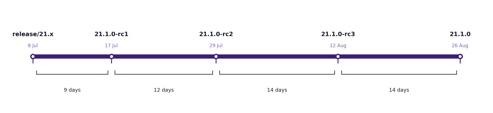
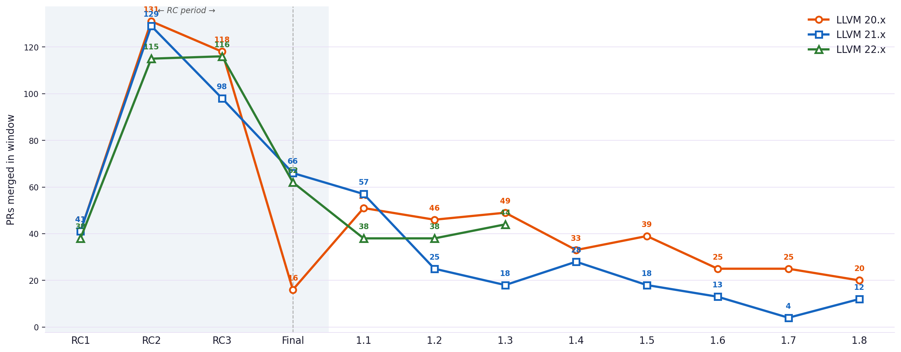
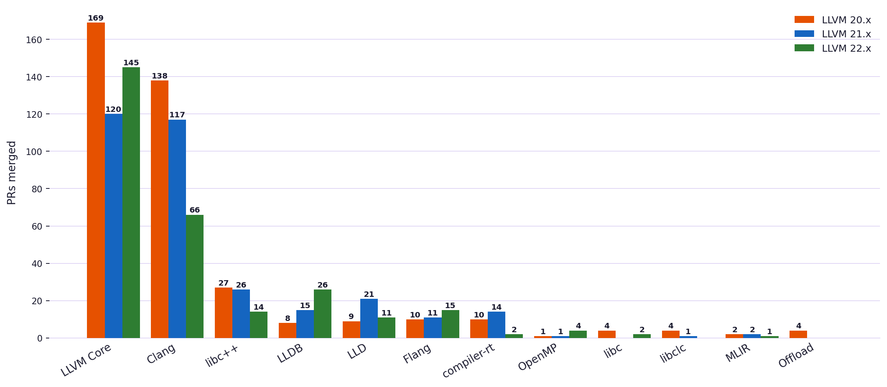
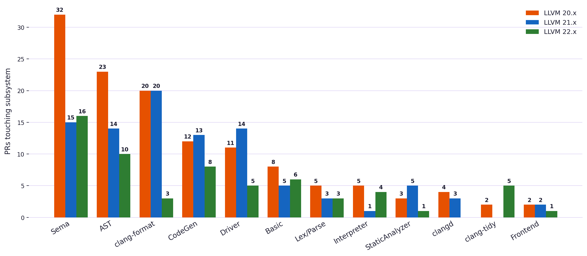
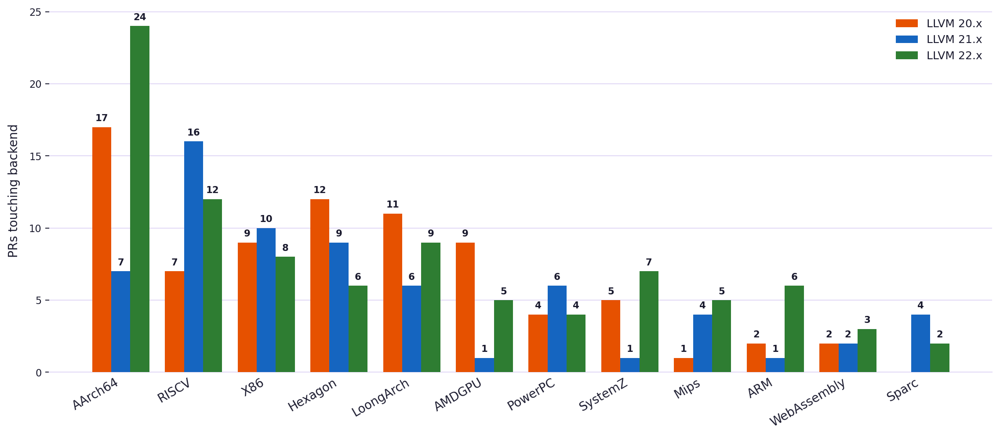
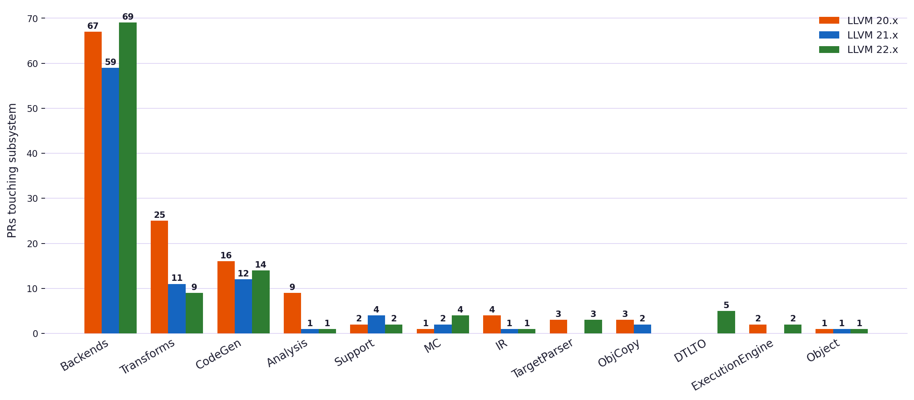
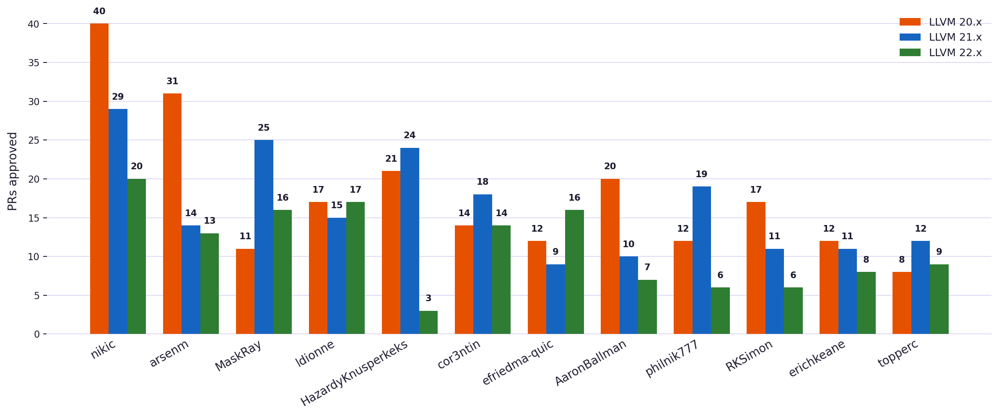
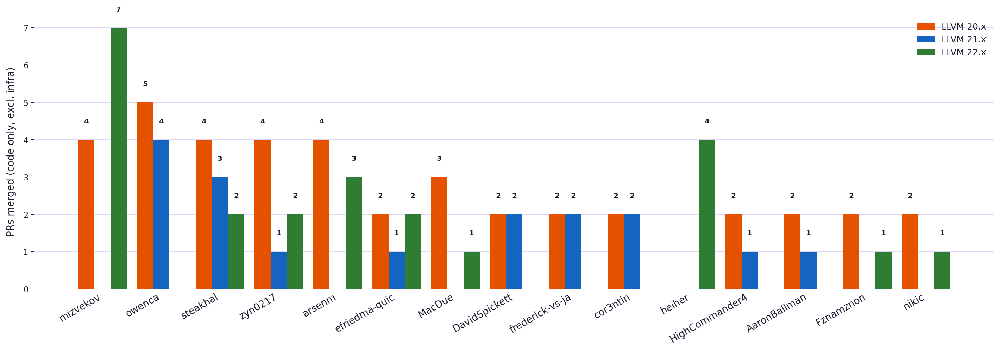

## LLVM Release Process
### EuroLLVM 2026 Status Update
Cullen Rhodes, Douglas Yung, Tobias Hieta

---

# Introductions

Note:
Welcome to your boring "eat your vegetables" session of the conference. Here you won't learn about a cool new optimization, some impressive size reduction or a three layered MLIR cake. We will just talk about the release process for 20 minutes. But first some introductions:

Cullen: [Cullen intro]

Douglas: [Douglas intro]

Tobias: And I am Tobias Hieta, I have been involved in the release process since LLVM 10 and been a release manager together with Tom since LLVM 15. I mostly work with AAA games and LLVM, currently working on Divinity for Larian.

---

# Recent Changes

* Two new Release Managers: **Cullen** and **Douglas**
* Stricter enforcement of acceptance criteria
* Automation updates
* Dropped split source packages

Note:
Tom Stellard and Tobias have been running releases for years. We brought in Cullen and Douglas to grow the team and spread the load. The plan is continuity — not a handoff. On the process side: we've tried to hold the line more firmly on what gets into RCs. Automation improvements have helped with tagging, notifications and tracking. We dropped split source packages as very few people were using them and they added maintenance burden.

---

# Current Process

* Major release every **6 months**
* Branch: 2nd Tuesday in **January** (even) / **July** (odd)
* Point releases every 2 weeks, typically through X.1.5 or X.1.6

Note:
Even-numbered releases branch in January, odd-numbered in July. The RC schedule is tight: rc1 goes out just 3 days after the branch, rc2 at 2 weeks, rc3 at 4 weeks, and the final release at 6 weeks. Point releases follow every two weeks after that. The docs list up to X.1.9 as a hard maximum, but in practice we usually stop around X.1.5 or X.1.6 unless something critical comes up.

---

# LLVM 21 Release Timeline

20.x RC1: **16 days late** &nbsp;·&nbsp; 21.x RC1: **6 days late** &nbsp;·&nbsp; 22.x RC1: **on time**

Note:
This is what the 21.x release actually looked like. Branch on July 8, RC1 came out 9 days later (the schedule says 3 days — already slipping). RC2 and RC3 were each about 2 weeks apart, and the final shipped August 26. Total: 49 days from branch to final.

---

# RC Acceptance Criteria

| Phase | Accepted |
|-------|----------|
| RC1 | Bug fixes, important optimizations, completion of features **started before branch** |
| RC2 / RC3 | Bug fixes, very safe backend-specific improvements |
| Final (X.1.0) | Critical bugs and regressions only |
| Point releases | Bug fixes, critical performance, must maintain API+ABI compat |

Note:
The docs are explicit that new features not completed by RC1 will be removed or disabled. The "started before branch" cutoff for RC1 is important — it's not a free pass to sneak in new work. In practice, enforcement is where things get interesting — we'll come back to this. Worth noting: the official docs also state "There are no official release qualification criteria" — the release manager decides when it's ready based on community testing, open bugs, and regressions. That's both flexibility and a source of friction.

---

# By the Numbers

| Release | PRs Merged | PRs Rejected | Issues |
|---------|-----------|--------------|--------|
| 20.x    | 406       | 53           | 125    |
| 21.x    | 343       | 68           | 122    |
| 22.x    | 309       | 76           | 89     |

Rejection rate rising: **12%** → **17%** → **20%**

Note:
These numbers are from the LLVM GitHub milestones, deduplicated so cherry-picks and their main-branch parents are counted only once. Rejections have been climbing — 53 → 68 → 76 — which reflects stricter acceptance criteria. Issues tracked under the milestone jumped in 22.x; hard to know if that's more problems being filed or more active milestone usage.

---

# PRs Merged by Phase

RC1→RC2 always **3× busier** than Branch→RC1 &nbsp;·&nbsp; RC3→Final: **9 PRs** (20.x) vs **42–46** (21.x / 22.x)

Note:
RC1→RC2 is the busiest window across all three releases — 115-131 PRs in roughly two weeks. The lines track closely until Final, where 20.x drops hard to just 16 PRs (we held the line). 21.x and 22.x both had 62-66 PRs in that final window — a lot of risk going in very late. The point release tail is interesting: 20.x stays elevated through 1.3 before fading, 21.x drops sharply after 1.1. 22.x through 1.3 is running at 38–44 PRs per point release — similar pace to 21.x early on.

Two things to highlight from this chart that connect directly to the pain points raised:

1. The 3x PR flood. Branch→RC1 is always around 38-41 PRs. Then RC1→RC2 jumps to 115-131 — a consistent 3x spike — across all three releases. Nobody is paying attention until RC1 ships, then everybody rushes.

2. The RC3→Final variance. The official criteria says RC3→Final should be critical bugs only — near zero. 20.x: 16 PRs (we enforced it). 21.x: 66. 22.x: 62. That's either criteria inconsistency or a reviewer availability problem causing patches to pile up until the very last window.

---

# PRs by Subproject

Note:
Subproject attribution is based on which top-level directory has the most files changed in each PR — more honest than reading the PR title. LLVM Core and Clang dominate as expected, but Clang has dropped noticeably in 22.x. LLDB had a quiet 21.x but came back strongly in 22.x. libc++ is consistently active. Flang is modest but steady.

---

# Clang: Subsystems

Note:
A PR is counted for a subsystem if it touches any file under that directory — so a PR fixing both Sema and AST counts in both. clang-format counts files under both clang/lib/Format and clang/tools/clang-format. clang-tidy and clangd come from clang-tools-extra. Sema dominates across all three releases. clang-format was very active in 20.x and 21.x but dropped sharply in 22.x. clang-tidy picked up in 22.x. clangd activity has faded — zero backports in 22.x.

---

# LLVM Core: Backends

Note:
A PR is counted for a backend if it touches any file under llvm/lib/Target/<Backend> — so a PR touching both AArch64 and CodeGen gets counted in both. AArch64 leads in 20.x and 22.x. RISC-V leads in 21.x and is consistently very active. Hexagon is surprisingly prominent — a dedicated team at Qualcomm does careful backport work. LoongArch is active in all three releases despite being a relatively new architecture — the team is clearly engaged. SystemZ jumps sharply in 22.x.

---

# LLVM Core: Subsystems

Note:
Backends (llvm/lib/Target) completely dominate — the majority of LLVM Core backports are backend-specific fixes rather than middle-end work. Transforms (optimization passes) is a consistent second, around 16-42 PRs per release. CodeGen is stable. Notable: DTLTO shows up with 10 PRs in 22.x but nothing before — it's a brand new feature that required several fixes right out of the gate.

---

# Who Reviews PRs

**nikic** alone: 58 PRs across 3 releases &nbsp;·&nbsp; top 5 reviewers handle the majority of all approvals

Note:
These are the people leaving approving reviews — the actual technical gatekeepers deciding whether a patch is safe to backport. nikic leads by a wide margin across all three releases (89 total). arsenm, ldionne, HazardyKnusperkeks (clang-format), MaskRay, and cor3ntin are all consistently present. This group is different from the mergers — these are domain experts doing the substantive review work, while the RM handles the mechanics of merging. The overlap between the two lists is small, which is healthy, but it means the review pool and the merge pool are both narrow. If nikic is unavailable, a significant chunk of Clang and middle-end reviews stalls.

---

# Who Submits PRs

~40 people do repeated work &nbsp;·&nbsp; most contributors appear only once

Note:
For completeness: these are the people opening the cherry-pick PRs — the ones requesting backports. llvmbot and infra-only PRs excluded. owenca leads, followed by nikic, mstorsjo, dtcxzyw, and ldionne. Notably, several names appear in all three lists — nikic and ldionne are submitting backports, reviewing others' backports, and occasionally merging. That kind of engagement is valuable but also a concentration risk.

---

# What Works

* Predictable cadence
* Community knows when to expect a release
* Milestone tracking on GitHub
* Release manager availability and responsiveness

Note:
The 6-month rhythm is actually one of the strongest parts of the current process. Distributions, downstream projects, and CI systems can plan around it. GitHub milestone tracking gives us decent visibility into what's in flight. The release managers have generally been reachable and responsive when people need help getting patches in or understanding criteria.

---

# What Doesn't Work

1. **No defined inclusion criteria** — every PR is a judgement call
2. **Flaky CI** blocks binary releases even when the code is ready
3. **Accidental ABI breakage** slips through reviews
4. **RC phase PR flood** — nobody looks until RC1 ships

Note:
These are the problems we as release managers actually feel every release.

Inclusion criteria: The docs say "There are no official release qualification criteria." We invented "very safe" but that's not a spec — two RMs can reach different verdicts on the same patch. The rising rejection rate (12% → 20%) shows we're trying to enforce something, but contributors deserve a clearer answer than our gut feeling.

Flaky CI: We need passing binary builds before we can ship. When CI is unreliable the release slips even when the code is done. Binaries sometimes follow the tag by days, which creates "mutable releases" that downstream consumers can't rely on.

ABI breakage: Changes that break API or ABI do get backported occasionally, missed during review. These are the most painful to discover post-release because they affect every downstream user silently.

PR flood: A consistent 3x spike from Branch→RC1 (~40 PRs) to RC1→RC2 (115–131) across every release. The rush makes careful review hard — we get a wave at every deadline instead of a steady stream.

---

# Join us at the Roundtable

### Right after this talk

What works? What should change? Come tell us.

Note:
Hand off to the roundtable. We want to hear from people who are using the releases, maintaining downstream forks, doing backports, or just frustrated with something. This is the right room and the right moment.

---

# Q&A
