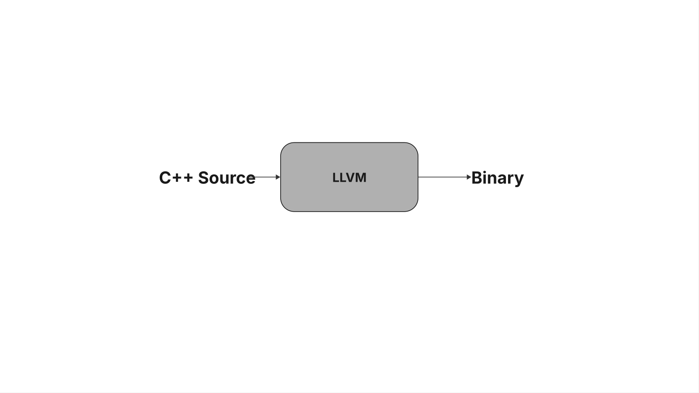
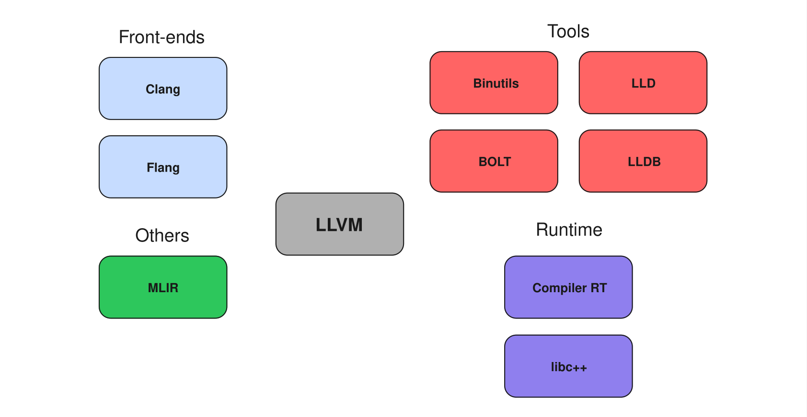
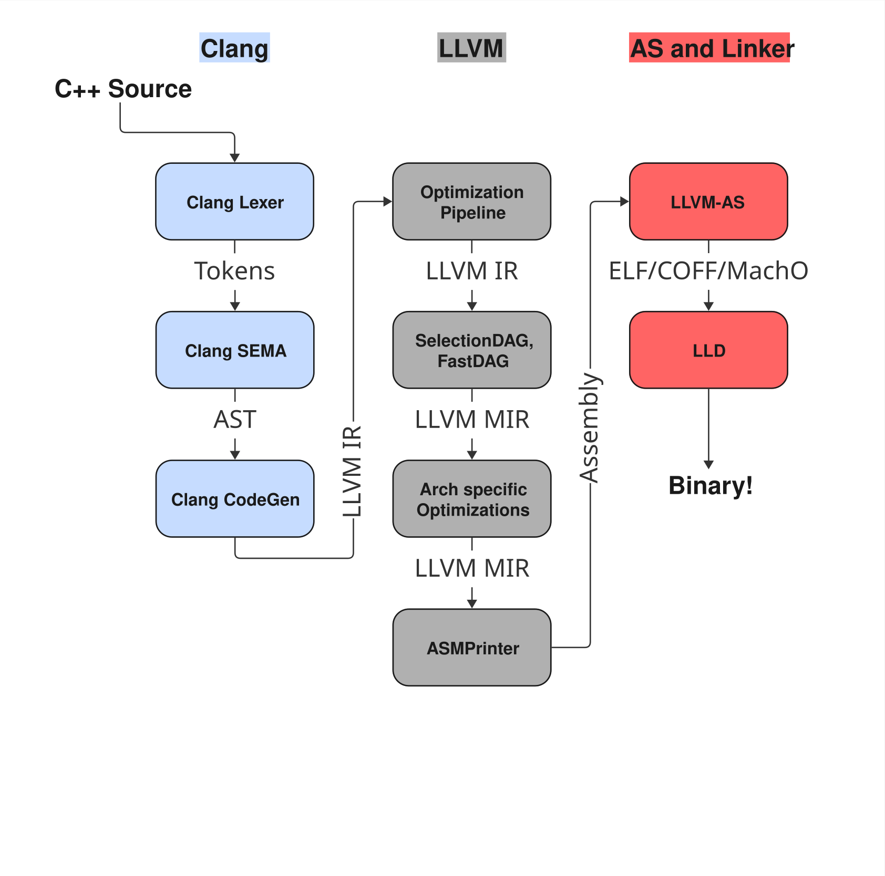
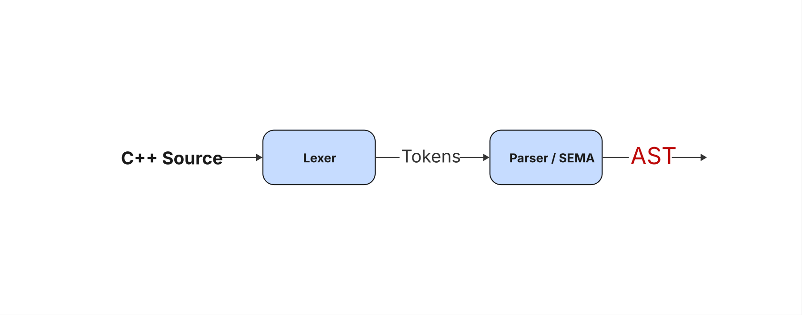
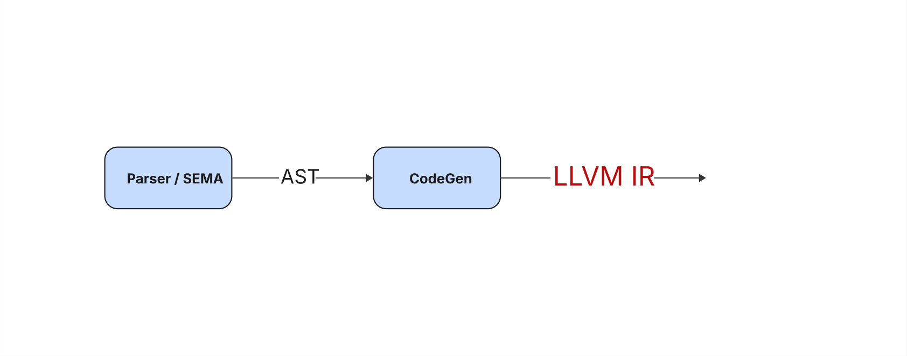
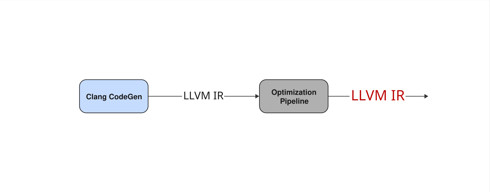
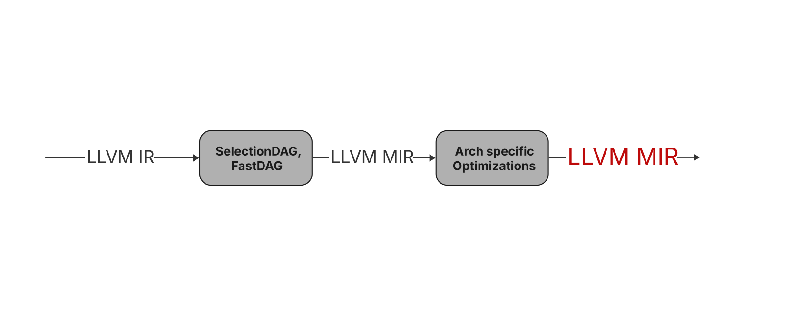
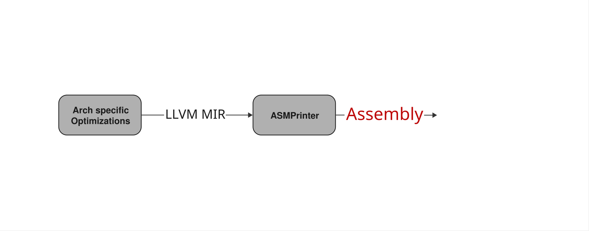

## A Brief Overview of the LLVM Architecture

tobias@hieta.se | Forge64 Consulting

---



---

## What **IS** LLVM?

---



---



---

## Example source

```C++ [1|2-8|9-14|1-14]
inline int add_one(int x) { return x + 1; }
int multiply(int a, int b) {
    int result = 0;
    for (int i = 0; i < 4; ++i) {
        result += a * b;
    }
    return result;
}
int main() {
    int value = 5;
    int inc = add_one(value);
    int prod  = multiply(inc, 3);
    return 0;
}
```

---

## Let's inspect the AST



---

## AST

```bash
clang++ -Xclang -ast-dump -fsyntax-only test.cpp
```

```
inline int add_one(int x) { return x + 1; }
```

```text [1|2|3-8|5]
|-FunctionDecl 0x141929108 <test.cpp:1:1, col:43> col:12 used add_one 'int (int)' inline
| |-ParmVarDecl 0x141929030 <col:20, col:24> col:24 used x 'int'
| `-CompoundStmt 0x141929288 <col:27, col:43>
|   `-ReturnStmt 0x141929278 <col:29, col:40>
|     `-BinaryOperator 0x141929258 <col:36, col:40> 'int' '+'
|       |-ImplicitCastExpr 0x141929240 <col:36> 'int' <LValueToRValue>
|       | `-DeclRefExpr 0x141929200 <col:36> 'int' lvalue ParmVar 0x141929030 'x' 'int'
|       `-IntegerLiteral 0x141929220 <col:40> 'int' 1
```

---

## CodeGen / LLVM-IR



---

## CodeGen / LLVM-IR

```bash
clang++ -O0 -S -emit-llvm test.cpp -o-
```

```
inline int add_one(int x) { return x + 1; }
```

```llvm [1|2|3-6|1-8]
; Function Attrs: mustprogress noinline nounwind optnone uwtable
define linkonce_odr dso_local noundef i32 @"?add_one@@YAHH@Z"(i32 noundef %0) #0 comdat {
  %2 = alloca i32, align 4
  store i32 %0, ptr %2, align 4
  %3 = load i32, ptr %2, align 4
  %4 = add nsw i32 %3, 1
  ret i32 %4
}
```

---

## Full IR

```llvm [1-36|38-53|55-62]
; Function Attrs: mustprogress noinline nounwind optnone uwtable
define dso_local noundef i32 @"?multiply@@YAHHH@Z"(i32 noundef %0, i32 noundef %1) #0 {
  %3 = alloca i32, align 4
  %4 = alloca i32, align 4
  %5 = alloca i32, align 4
  %6 = alloca i32, align 4
  store i32 %1, ptr %3, align 4
  store i32 %0, ptr %4, align 4
  store i32 0, ptr %5, align 4
  store i32 0, ptr %6, align 4
  br label %7

7:                                                ; preds = %16, %2
  %8 = load i32, ptr %6, align 4
  %9 = icmp slt i32 %8, 4
  br i1 %9, label %10, label %19

10:                                               ; preds = %7
  %11 = load i32, ptr %4, align 4
  %12 = load i32, ptr %3, align 4
  %13 = mul nsw i32 %11, %12
  %14 = load i32, ptr %5, align 4
  %15 = add nsw i32 %14, %13
  store i32 %15, ptr %5, align 4
  br label %16

16:                                               ; preds = %10
  %17 = load i32, ptr %6, align 4
  %18 = add nsw i32 %17, 1
  store i32 %18, ptr %6, align 4
  br label %7, !llvm.loop !8

19:                                               ; preds = %7
  %20 = load i32, ptr %5, align 4
  ret i32 %20
}

; Function Attrs: mustprogress noinline norecurse optnone uwtable
define dso_local noundef i32 @main() #1 {
  %1 = alloca i32, align 4
  %2 = alloca i32, align 4
  %3 = alloca i32, align 4
  %4 = alloca i32, align 4
  store i32 0, ptr %1, align 4
  store i32 5, ptr %2, align 4
  %5 = load i32, ptr %2, align 4
  %6 = call noundef i32 @"?add_one@@YAHH@Z"(i32 noundef %5)
  store i32 %6, ptr %3, align 4
  %7 = load i32, ptr %3, align 4
  %8 = call noundef i32 @"?multiply@@YAHHH@Z"(i32 noundef %7, i32 noundef 3)
  store i32 %8, ptr %4, align 4
  ret i32 0
}

; Function Attrs: mustprogress noinline nounwind optnone uwtable
define linkonce_odr dso_local noundef i32 @"?add_one@@YAHH@Z"(i32 noundef %0) #0 comdat {
  %2 = alloca i32, align 4
  store i32 %0, ptr %2, align 4
  %3 = load i32, ptr %2, align 4
  %4 = add nsw i32 %3, 1
  ret i32 %4
}
```

---

## Optimization Pipeline



---

## Optimization Pipeline

```bash
clang++ -O2 -S -emit-llvm test.cpp -o-
```

```llvm [1-6|7-10|1-10]
; Function Attrs: mustprogress nofree norecurse nosync nounwind willreturn memory(none) uwtable
define dso_local noundef range(i32 0, -3) i32 @"?multiply@@YAHHH@Z"(i32 noundef %0, i32 noundef %1) local_unnamed_addr #0 {
  %3 = mul i32 %1, %0
  %4 = shl i32 %3, 2
  ret i32 %4
}

; Function Attrs: mustprogress nofree norecurse nosync nounwind willreturn memory(none) uwtable
define dso_local noundef i32 @main() local_unnamed_addr #0 {
  ret i32 0
}
```

---

## Example Pass

From: https://github.com/10x-Engineers/tutorial-llvm-pass

```c++ [3-4|5|6|7-8|9-14]
Modified = false;
for (auto &BB : F) {
    for (auto I = BB.begin(), E = BB.end(); I != E; ) {
        Instruction *Inst = &(*I++);
        if (auto *Mul = dyn_cast<BinaryOperator>(Inst)) {
            if (Mul->getOpcode() == Instruction::Mul) {
                if (auto *C = dyn_cast<ConstantInt>(Mul->getOperand(1))) {
                    if (C->getValue().isPowerOf2()) {
                        IRBuilder<> Builder(Mul);
                        Value *ShiftAmount = Builder.getInt32(C->getValue().exactLogBase2());
                        Value *NewMul = Builder.CreateShl(Mul->getOperand(0), ShiftAmount);
                        Mul->replaceAllUsesWith(NewMul);
                        Mul->eraseFromParent();
                        Modified = true;
                    }
                }
            }
        }
    }
}
```

---

## Example Pass

Changes

```
%5 = mul nsw i32 %4, 4
store i32 %5, ptr %3, align 4
```

```
%5 = shl i32 %4, 2
store i32 %5, ptr %3, align 4
```

---

## MIR - Machine IR



---

## MIR - Machine IR

```llvm
; Function Attrs: mustprogress noinline nounwind optnone ssp uwtable(sync)
define linkonce_odr dso_local noundef i32 @"?add_one@@YAHH@Z"(i32 noundef %0) #0 comdat {
  %2 = alloca i32, align 4
  store i32 %0, ptr %2, align 4
  %3 = load i32, ptr %2, align 4
  %4 = add nsw i32 %3, 1
  ret i32 %4
}
```

```text
MOV32mr %stack.0, 1, $noreg, 0, $noreg, killed renamable $ecx :: (store (s32) into %ir.2)
renamable $eax = MOV32rm %stack.0, 1, $noreg, 0, $noreg :: (load (s32) from %ir.2)
renamable $eax = ADD32ri killed renamable $eax, 1, implicit-def dead $eflags
RET64 implicit $eax
```

---

## ASM



---

## Assembly

```bash
clang++ -O0 test.cpp -S -o-
```

```x86asm
"?add_one@@YAHH@Z":
        pushq   %rax
        movl    %ecx, 4(%rsp)
        movl    4(%rsp), %eax
        addl    $1, %eax
        popq    %rcx
        retq
```

---

## Full ASM

```x86asm [1-21|22-35|36-42]
"?multiply@@YAHHH@Z":
        subq    $16, %rsp
        movl    %edx, 12(%rsp)
        movl    %ecx, 8(%rsp)
        movl    $0, 4(%rsp)
        movl    $0, (%rsp)
.LBB0_1:
        cmpl    $4, (%rsp)
        jge     .LBB0_4
        movl    8(%rsp), %eax
        imull   12(%rsp), %eax
        addl    4(%rsp), %eax
        movl    %eax, 4(%rsp)
        movl    (%rsp), %eax
        addl    $1, %eax
        movl    %eax, (%rsp)
        jmp     .LBB0_1
.LBB0_4:
        movl    4(%rsp), %eax
        addq    $16, %rsp
        retq
main:
        subq    $56, %rsp
        movl    $0, 52(%rsp)
        movl    $5, 48(%rsp)
        movl    48(%rsp), %ecx
        callq   "?add_one@@YAHH@Z"
        movl    %eax, 44(%rsp)
        movl    44(%rsp), %ecx
        movl    $3, %edx
        callq   "?multiply@@YAHHH@Z"
        movl    %eax, 40(%rsp)
        xorl    %eax, %eax
        addq    $56, %rsp
        retq
"?add_one@@YAHH@Z":
        pushq   %rax
        movl    %ecx, 4(%rsp)
        movl    4(%rsp), %eax
        addl    $1, %eax
        popq    %rcx
        retq
```

---

## Optimized ASM

```x86asm [1-4|5-7]
"?multiply@@YAHHH@Z":
        imull   %edx, %ecx
        leal    (,%rcx,4), %eax
        retq
main:
        xorl    %eax, %eax
        retq
```

---

## From **this** to **that**

```C++
inline int add_one(int x) { return x + 1; }
int multiply(int a, int b) {
    int result = 0;
    for (int i = 0; i < 4; ++i) {
        result += a * b;
    }
    return result;
}
int main() {
    int value = 5;
    int inc = add_one(value);
    int prod  = multiply(inc, 3);
    return 0;
}
```

```x86asm
"?multiply@@YAHHH@Z":
        imull   %edx, %ecx
        leal    (,%rcx,4), %eax
        retq
main:
        xorl    %eax, %eax
        retq
```

---


---

## We have arrived!

## Questions?
